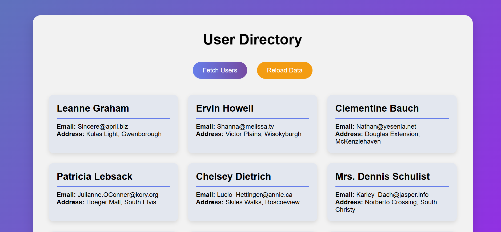

# User Directory

A simple responsive web application that fetches and displays user information from a public API.  

## Features

- Fetch user data from an API
- Display user **Name, Username, Email, Address, and Company**
- Responsive layout for **desktop and mobile**
- Error handling for network failures
- Reload button to refetch users
- Loading message while fetching data

## Technologies Used

- HTML5
- CSS3
- JavaScript (Fetch API)

## API Used

User data is fetched from the following API:

https://jsonplaceholder.typicode.com/users

This API is provided by **JSONPlaceholder**, a free fake REST API for testing and learning.

## Screenshot

## How to Run

1. Download or clone the project folder.
2. Open the folder in **VS Code**.
3. Open `index.html` in a browser.
4. Click **Fetch Users** to load user data.

